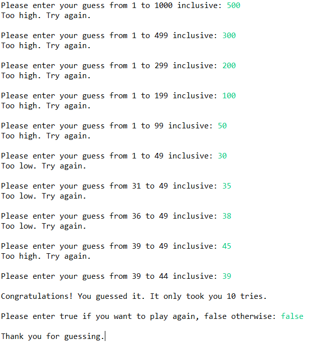

Number Guessing Game

Description: 

The program randomly selects a number between 1 and 1000. The user enters their first guess, and if the guess is incorrect the program states whether the number entered is too high or too low. After every guess the new range is displayed, allowing for a better chance of arriving at the correct answer. If the user wants to keep playing, they can enter true/false at the last prompt. Every time the user guesses the right answer, the number of total attempts gets displayed. 

Below is a sample run:

